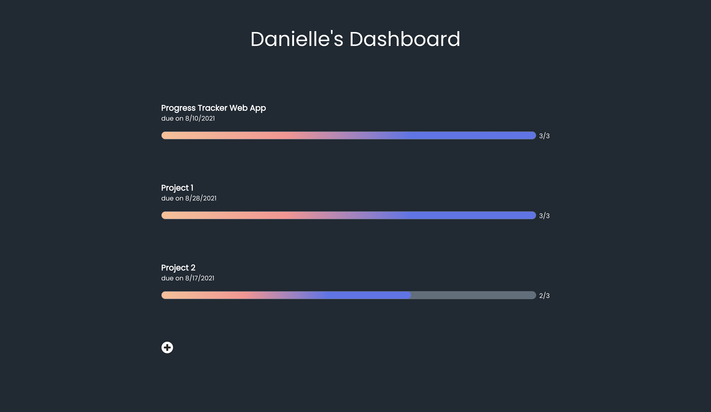

# On Track

> A responsive web application for tracking the progress of multiple projects.

## General Information

One of my favorite practices for staying on top of my work is setting personal deadlines for assignments. This lets me know I am staying on track and getting things done on time. To facilitate this, I decided to design my ideal progress tracking workspace for my final year at LSU and that's exactly what On Track is.

## Technologies USed

-   React - version 3.5.1
-   Chakra UI - version 1.6.0
-   Firebase - version 8.8.1

## Screenshots

