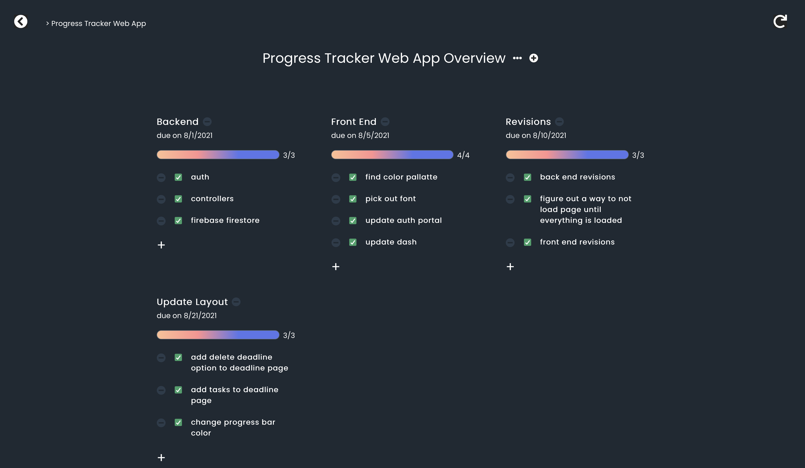

# On Track

> A responsive web application for tracking the progress of multiple projects.

## General Information

One of my favorite practices for staying on top of my work is setting personal deadlines for assignments. This lets me know I am staying on track and getting things done on time. To facilitate this, I decided to design my ideal progress tracking workspace for my final year at LSU and that's exactly what On Track is.

## Technologies Used

-   React - version 3.5.1
-   Chakra UI - version 1.6.0
-   Firebase - version 8.8.1

## Screenshots

Dashboard


Project Overview


## Setup

To run this project, install it locally using yarn or npm

yarn

```
$ cd ../progress-tracker
$ yarn
$ yarn start
```

npm

```
$ cd ../progress-tracker
$ npm install
$ npm start
```

## Features

-   Add all ongoing projects to your dashboard so you can visually see the progress of each one
-   Set deadlines within your projects to make sure you are staying on track
-   Check off tasks as you complete them

## Contact

Created by [Dani Tyler](https://www.dani-tyler.com)
